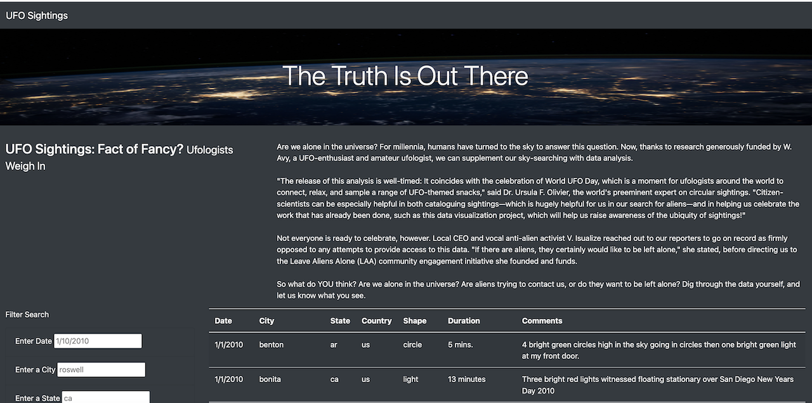
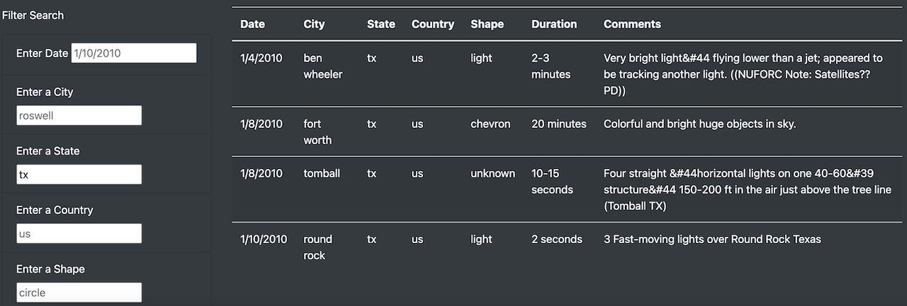

# UFOs
## Overview of the project
The purpose of the project is to create a webpage using JavaScript and HTML to provide an in-depth analysis of UFO sightings by allowing users to filter for multiple criteria (date, city, state, country, and shape) at the same time.

## Results
1. This is the screenshot of our webpage with table filters. 

2. Our webpage can display the UFO sightings that have been reported around the world. You can search for UFO sightings by inputing one or more combined criteria into the filters: date, city, state, country, and shape. The table will filter the results accordingly.Also, clicking on "UFO sightings" at the top left corner will reset the table by clearing out all previous filters.  Below is an example showing the search results for the UFO sightings recorded at the state of Texas, US. 

## Summary
One drawback of the webpage is that users may not get the results as they expected due to the small sample dataset, which only recorded the UFO sightings from 1/1/2010 - 1/13/2010. Therefore, if users searches for date not in that timeframe, or some other random cities/states, for example, san francisco, they will not get any results. 

In order to make a more user-friendly webpage, here are two recommendations for further development.
* To avoid the above drawbacks, we can add a drop-down menu in each filter to allow the user to select an option within the menu.
* To improve the site search experience, We can create and place a convenient "Reset" button next to the "Filter Search" form instead of using the "UFO sightings" at the top left corner.

